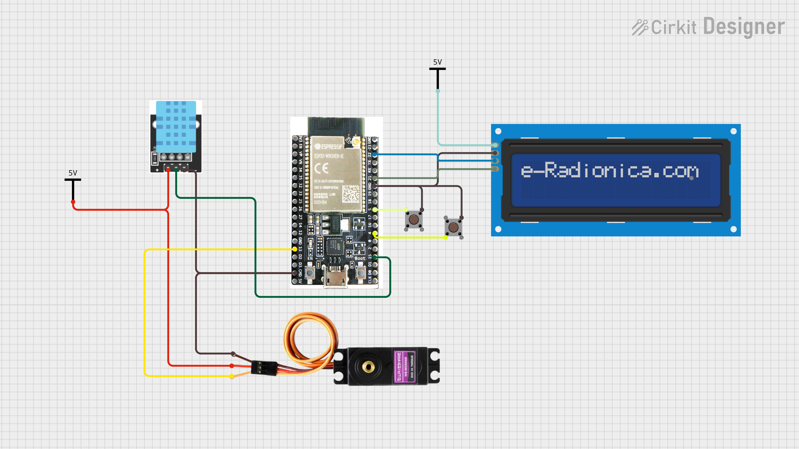

# 🔧 ESP32 Basic Project

Projeto de exemplo para ESP32 que integra controle de um servo, leitura de sensor DHT (temperatura e umidade) e exibição em display (16x2). O firmware foi organizado com FreeRTOS tasks para leitura periódica do DHT, atualização de display, controle do servo e saída para monitor serial.

## ✨ Funcionalidades

- Controle de um servo por botões físicos (incremento/decremento do ângulo).
- Leitura periódica de temperatura e umidade via sensor DHT.
- Exibição do ângulo do servo em display 16x2 (I2C).
- Envio de temperatura e umidade para monitor serial.

## 📦 Hardware necessário

- Placa ESP32
- Servo motor (ex.: SG90)
- Sensor DHT (DHT11 ou DHT22)
- Display 16x2 com interface I2C
- 2 botões (botões de pressão)
- Fios e fonte de alimentação adequada para o servo


## 🔌 Pinos usados (conforme `firmware/src/main.cpp`)

- Servo: GPIO 13
- Botão Aumentar Ângulo: GPIO 4 (INPUT_PULLUP)
- Botão Diminuir Ângulo: GPIO 5 (INPUT_PULLUP)
- Sensor DHT: GPIO 15
- I2C Display: SDA = GPIO 21, SCL = GPIO 22

Conecte os botões ao GND e aos pinos indicados (com pull-up interno habilitado no firmware). Ajuste pinos no código caso precise usar outros pinos.



## 🛠️ Software / Ferramentas

- PlatformIO (recomendado) integrado ao VS Code
- Toolchain para ESP32 (PlatformIO cuidará disso automaticamente ao compilar)

## 🚀 Compilar e gravar (PlatformIO)

No terminal do projeto (ou usando as opções do PlatformIO no VS Code):

```bash
# Compilar
platformio run

# Gravar no dispositivo (substitua -e <env> se necessário)
platformio run -t upload

# Monitor serial (baud usado no projeto: 115200)
platformio device monitor -b 115200
```

Também é possível usar os botões do menu do PlatformIO no VS Code: "Build", "Upload" e "Monitor".

## 📁 Estrutura do projeto

```
├── 📁 firmware
│   ├── 📁 include
│   │   ├── ⚡ dht.hpp
│   │   ├── ⚡ display.hpp
│   │   └── ⚡ servo.hpp
│   ├── 📁 lib
│   ├── 📁 src
│   │   ├── ⚡ dht.cpp
│   │   ├── ⚡ display.cpp
│   │   ├── ⚡ main.cpp
│   │   └── ⚡ servo.cpp
│   ├── 📁 test
│   ├── ⚙️ .gitignore
│   └── ⚙️ platformio.ini
├── 📝 README.md
└── 🖼️ circuit_image.png
```

## 📝 Como usar

1. Conecte a placa ESP32 ao computador via USB.
2. Verifique as ligações do sensor, display, servo e botões conforme a seção de pinos.
3. Compile e grave o firmware com PlatformIO.
4. Abra o monitor serial (115200) para ver leituras de temperatura e umidade.
5. Use os botões físicos para ajustar o ângulo do servo; o display mostrará o ângulo atual.

## 💡 Dicas e solução de problemas

- Se o servo oscila ou não tem torque suficiente, use uma fonte externa de alimentação adequada.
- Se o DHT não responder, verifique o pino e o tipo do sensor (DHT11 vs DHT22) e a biblioteca.
- Se o display não inicializar, verifique o endereço I2C e os pinos SDA/SCL.
- Mensagens de erro na serial aparecem no `setup()` caso algum módulo não tenha sido configurado corretamente — revise as mensagens imprimidas.


## ⏱️ Uso do FreeRTOS para elaboração de um sistema de tempo real

Este projeto organiza a aplicação em várias tasks do FreeRTOS para obter comportamento determinístico e responsivo. Abaixo está um resumo de como o FreeRTOS é utilizado neste firmware e por que isso ajuda a construir um sistema de tempo real simples e robusto.

| Task | Core | Prioridade | Descrição |
|---|:---:|:---:|---|
| vTaskAdjustServo | 1 | 2 | Ajusta servo quando interrupção externa de botões |
| vTaskUpdateDisplay | 1 | 1 | Atualiza display com o ângulo atual, temperatura e umidade |
| vTaskGetTemperature | 0 | 1 | Obtém temperatura através do DHT |
| vTaskGetHumidity | 0 | 1 | Obtém umidade através do DHT |


